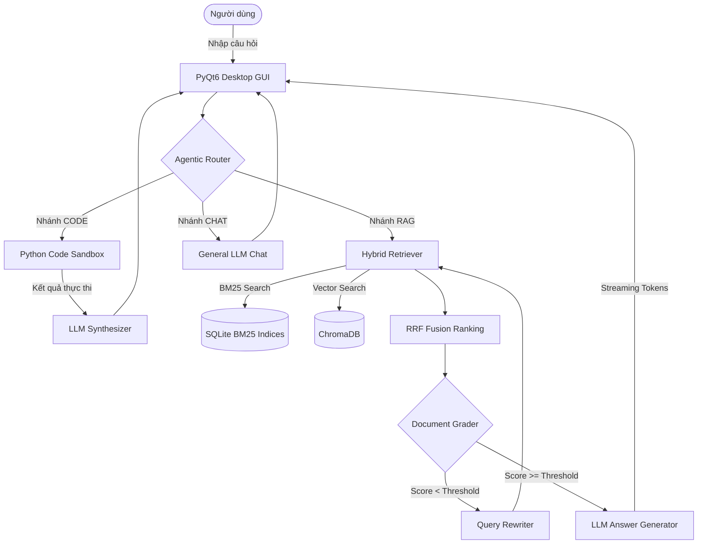
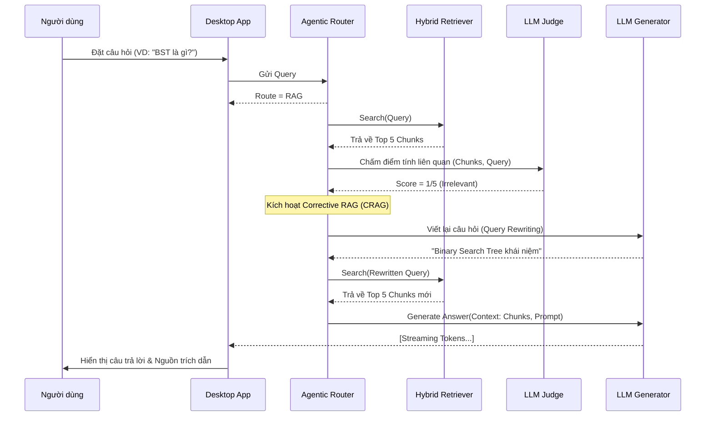

# Local Study RAG Agent

Hệ thống Trợ lý Học tập Cục bộ áp dụng mô hình **Advanced RAG (Retrieval-Augmented Generation)** và **Hybrid Search**, được thiết kế đặc biệt để hỗ trợ tra cứu, học tập và tổng hợp kiến thức từ các tài liệu học thuật chuyên sâu một cách hoàn toàn offline (Local-first).

---

## 1. Tổng quan dự án

### Bài toán cần giải quyết
Sinh viên và các nhà nghiên cứu thường xuyên phải xử lý một khối lượng lớn tài liệu học thuật (sách giáo trình, bài báo khoa học, slide bài giảng) định dạng PDF. Việc tra cứu thông tin thủ công tốn rất nhiều thời gian. Các giải pháp Cloud AI hiện tại (như ChatGPT, Claude) đòi hỏi kết nối Internet liên tục, tiềm ẩn rủi ro lộ lọt dữ liệu và thường bị giới hạn về Context Window hoặc chi phí sử dụng API.

### Đối tượng sử dụng
* **Sinh viên CNTT:** Cần tra cứu nhanh các khái niệm cấu trúc dữ liệu, giải thuật, và code mẫu.
* **Giảng viên & Nhà nghiên cứu:** Cần tìm kiếm và tổng hợp thông tin từ nhiều tài liệu tham khảo khác nhau mà không muốn tải tài liệu cá nhân lên Cloud.

### Giá trị thực tiễn
* Đảm bảo **100% Privacy** (Quyền riêng tư) nhờ chạy toàn bộ mô hình ngôn ngữ (LLM) và Vector Database trên máy tính cá nhân.
* Cải thiện tốc độ tra cứu và đọc hiểu thông qua công cụ phân tích Agentic AI.
* Môi trường học tập All-in-One tích hợp Code Sandbox để thực thi và kiểm chứng thuật toán trực tiếp.

### Điểm nổi bật của hệ thống
* **Agentic Query Routing:** Tự động định tuyến câu hỏi của người dùng (RAG Document Search, Code Execution, hoặc General Chat).
* **Heuristic Semantic Chunking:** Cơ chế phân rã tài liệu với tốc độ siêu cao (High-performance), bảo toàn ngữ nghĩa đoạn văn mà không cần gọi API Embedding.
* **Hybrid Retrieval (RRF Fusion):** Kết hợp giữa Vector Search (Semantic) và BM25 (Keyword) để đảm bảo độ chính xác (Precision) và độ phủ (Recall) cao nhất.
* **CRAG (Corrective RAG):** Hệ thống Grader tự động chấm điểm tính liên quan của kết quả tìm kiếm và tự động viết lại truy vấn (Query Rewriting) nếu kết quả chưa đạt yêu cầu.

---

## 2. Kiến trúc hệ thống

Dự án được xây dựng theo mô hình **MVC (Model-View-Controller)** kết hợp **Service Layer / Pipeline Pattern** cho các thành phần AI.

### Mô tả chi tiết các tầng
* **Frontend (Presentation Layer):** Giao diện Desktop đa nền tảng được phát triển bằng `PyQt6`, thiết kế tối giản, hỗ trợ Dark/Light mode và hệ thống Tabs (Explain, Visualization, Settings).
* **Backend (Logic Layer):** Xử lý logic nghiệp vụ bằng Python. Tầng này điều phối các tác vụ RAG, quản lý vòng đời Agent và thực thi Sandbox.
* **Database (Data Layer):** Lưu trữ kết hợp giữa `SQLite` (Relational) cho Metadata/Lịch sử và `ChromaDB` (Vector Store) cho Embeddings.
* **AI Components:** Sử dụng hệ sinh thái `Ollama` để chạy các Local LLMs. Phân tách rõ ràng giữa mô hình Sinh văn bản (Generator) và mô hình Đánh giá (Judge).

### Sơ đồ luồng xử lý tổng quát (Data Flow)



---

## 3. Công nghệ sử dụng

| Thành phần | Công nghệ / Thư viện | Vai trò |
| :--- | :--- | :--- |
| **Ngôn ngữ lập trình** | Python 3.13 | Xây dựng logic Backend & AI Pipeline |
| **Giao diện (GUI)** | PyQt6 | Phát triển Desktop Application |
| **Local AI Engine** | Ollama | Quản lý và chạy các mô hình LLM Cục bộ |
| **LLM Generator** | Qwen2.5-coder:7b | Sinh mã nguồn, tổng hợp câu trả lời |
| **LLM Evaluator (Judge)**| Qwen2.5:14b | Chấm điểm tài liệu (Document Grading) |
| **Embedding Model** | nomic-embed-text | Chuyển đổi văn bản thành Vector (768 chiều) |
| **Vector Database** | ChromaDB | Lưu trữ và truy vấn Vector |
| **Relational Database** | SQLite 3 | Lưu trữ Metadata, BM25 Index, Chat History |
| **Keyword Search** | Rank-BM25 | Thuật toán tìm kiếm theo từ khóa (Lexical Search) |

---

## 4. Cấu trúc thư mục

```text
Local_Study_RAG_Agent/
├── analytics/         # Chứa các script xuất báo cáo thống kê, biểu đồ, thesis tables.
├── core/              # Lõi nghiệp vụ AI và Xử lý tài liệu
│   ├── document_processor/  # Xử lý PDF và Text Extraction
│   │   └── chunking/        # Các chiến lược cắt văn bản (Heuristic, Recursive, Fixed)
│   ├── evaluation/          # Đánh giá chất lượng RAG bằng RAGAS
│   ├── pipeline/            # Luồng Advanced RAG, Answer Generator, Grader
│   └── retrieval/           # Hybrid Search (BM25, Vector Search)
├── data/              # Nơi lưu trữ CSDL và Benchmarks (Git Ignored)
│   ├── chromadb/            # Dữ liệu vector
│   └── experiments/         # Dataset Benchmark (CSV)
├── experiments/       # Các kịch bản chạy thử nghiệm độ trễ, độ phủ (Ablation study)
├── modules/           # Các module mở rộng độc lập
│   ├── algorithm_visualizer/# (Planned Feature) Trực quan hóa giải thuật
│   └── code_sandbox.py      # Môi trường thực thi code Python cách ly
├── subjects/          # Thư mục chứa tài liệu học tập phân theo môn (DSA, DBMS, OOP)
├── ui/                # Component giao diện PyQt6
│   └── tabs/                # Các màn hình chức năng (Tab_Explain, ...)
├── utils/             # Các hàm tiện ích dùng chung (Config, Logger, Database Schema)
├── global_config.yaml # Tệp tin cấu hình tổng của hệ thống
└── main.py            # Entry point để khởi chạy ứng dụng
```

---

## 5. Các module chức năng chính

### 5.1. Module Document Ingestion & Chunking
* **Mục đích:** Đưa tài liệu định dạng PDF vào hệ thống và chuẩn hóa để máy tính hiểu được.
* **Chức năng:** Trích xuất văn bản thô từ PDF, dọn dẹp ký tự nhiễu. Sử dụng `Heuristic Semantic Chunker` để phân mảnh tài liệu (Chunking) dựa trên cấu trúc đoạn văn, giới hạn độ dài (tokens) hợp lý nhằm không làm mất ngữ cảnh.
* **Thành phần liên quan:** `core/document_processor/pdf_reader.py`, `core/document_processor/chunking/semantic_chunker.py`.
* **Output:** Danh sách các đối tượng `Chunk` chứa văn bản, metadata (tên file, số trang) và mối liên kết Parent-Child.

### 5.2. Module Hybrid Retrieval
* **Mục đích:** Tìm kiếm chính xác các phân đoạn tài liệu phù hợp với câu hỏi của người dùng.
* **Luồng xử lý:** Câu hỏi được đưa qua hai kênh song song. Kênh 1 (`vector_search.py`) dùng `nomic-embed-text` để so khớp ngữ nghĩa. Kênh 2 (`bm25_search.py`) tính toán tần suất xuất hiện từ khóa. Cuối cùng, thuật toán **Reciprocal Rank Fusion (RRF)** gộp và tính điểm lại (re-ranking) để đưa ra Top K chunks tốt nhất.

### 5.3. Pipeline Advanced RAG & CRAG
* **Mục đích:** Não bộ của hệ thống.
* **Luồng xử lý:** 
  1. `route_query` phân loại ý định người dùng (Hỏi bài, Nhờ viết code, hay Trò chuyện).
  2. Nếu là Hỏi bài (RAG), gọi Hybrid Retrieval.
  3. `retrieval_grader` đóng vai trò là "Giám khảo", đọc lướt qua kết quả. Nếu thấy kết quả kém (Score < 3), nó ra lệnh cho `rewrite_query` viết lại câu hỏi và tìm kiếm lần 2.
  4. Nếu kết quả tốt, đưa ngữ cảnh cho mô hình Sinh văn bản (Generator) để trả lời.

### 5.4. Module Code Sandbox
* **Mục đích:** Hỗ trợ sinh viên thực thi và kiểm chứng các thuật toán được AI sinh ra ngay trên phần mềm.
* **Cơ chế:** Nhận mã nguồn Python từ LLM, lưu vào môi trường tạm (scratch), thực thi bằng `subprocess` thu thập `stdout`, `stderr` và trả về cho hệ thống tổng hợp để giải thích lỗi (nếu có).

### 5.5. Module Algorithm Visualizer (Planned Feature)
* **Mục đích:** Trực quan hóa quá trình chạy của các cấu trúc dữ liệu và giải thuật (Cây nhị phân, Đồ thị, Sắp xếp).
* **Tình trạng:** Khung sườn kiến trúc (Tracers, Data Structures) đã được xây dựng trong `modules/visualizer/`, hiện tại đang ở mức Future Work chờ được tích hợp vào UI.

---

## 6. Pipeline RAG Chi Tiết

Sơ đồ tuần tự thể hiện vòng đời của một truy vấn RAG trong hệ thống:



---

## 7. Cơ sở dữ liệu

Hệ thống sử dụng cơ chế lưu trữ phân tán hiệu quả:

1. **ChromaDB (`data/chroma_db`)**
   - **Collections:** Phân chia theo từng môn học (VD: `dsa`, `dbms`).
   - **Lưu trữ:** Vectơ 768 chiều cho từng chunk, đi kèm metadata (doc_name, page_num, chunk_id).

2. **SQLite 3 (`data/study_agent.db`)**
   - **Bảng `document_parents`:** Lưu trữ toàn bộ văn bản gốc của các chunk mẹ (Parent Chunk) để phục vụ cho Parent-Child Retrieval. Tránh làm phình dung lượng của Vector DB.
   - **Bảng `chat_history`:** Lưu trữ phiên làm việc của người dùng.
   - **Bảng `evaluation_logs`:** (Analytics) Ghi lại toàn bộ log benchmark, điểm số, thời gian thực thi của từng truy vấn để đánh giá hệ thống.

---

## 8. Hướng hoạt động của người dùng (Use Cases)

1. **Khởi tạo:** Trong lần đầu tiên, hệ thống mở Setup Wizard cho phép người dùng khai báo thông tin thiết bị và khởi tạo các bảng SQLite.
2. **Upload tài liệu:** Người dùng kéo thả file PDF vào thư mục `subjects/dsa/documents/`. Hệ thống tự động quét và gọi Ingestion để nạp vào Vector DB.
3. **Hỏi đáp & Luyện tập:** Tại tab Explain, người dùng nhập câu hỏi. AI tự động tra cứu trong DB để giải thích dựa trên giáo trình.
4. **Viết Code:** Nhập một yêu cầu lập trình (Ví dụ: "Hãy viết thuật toán Dijkstra"). Hệ thống nhận diện đây là yêu cầu code, tự động sinh mã, thực thi trong Sandbox và trả về cả giải thuật lẫn kết quả biên dịch.

---

## 9. Hướng dẫn cài đặt và khởi chạy

### 9.1. Yêu cầu hệ thống
* **Hệ điều hành:** Windows 10/11, macOS, hoặc Linux.
* **Môi trường:** Python 3.13+.
* **Phần cứng đề nghị:** RAM tối thiểu 16GB. Khuyến nghị có GPU (NVIDIA RTX 3060 trở lên) để chạy Ollama mượt mà, nhưng vẫn có thể chạy thuần trên CPU (sẽ chậm hơn).

### 9.2. Cài đặt các thành phần phụ thuộc

1. **Cài đặt Ollama:** Tải và cài đặt [Ollama](https://ollama.com/).
2. **Kéo các mô hình cần thiết:** Mở Terminal và chạy:
   ```bash
   ollama pull qwen2.5-coder:7b
   ollama pull qwen2.5:14b
   ollama pull nomic-embed-text
   ```

3. **Cài đặt thư viện Python:**
   ```bash
   git clone <repo_url>
   cd Local_Study_RAG_Agent
   python -m venv venv
   # Kích hoạt môi trường ảo:
   # Windows: .\venv\Scripts\activate
   # Linux/Mac: source venv/bin/activate
   pip install -r requirements.txt
   ```

### 9.3. Khởi chạy dự án
```bash
python main.py
```
Trong lần chạy đầu tiên, hệ thống sẽ bật Setup Wizard và tự động khởi tạo cơ sở dữ liệu.

---

## 10. Đánh giá hệ thống (System Evaluation)

Dự án đi kèm bộ công cụ Evaluation nội bộ tại thư mục `experiments/` sử dụng file dữ liệu mẫu `data/experiments/benchmark_questions_v2.csv` (Bộ 60 câu hỏi chuẩn).
Các chỉ số đã được đo lường tự động trên Benchmark:

* **Retrieval Quality (Hybrid Search + Heuristic Chunker):**
  * **Hit@5:** Thể hiện tỷ lệ lấy được tài liệu có chứa từ khóa Ground Truth lọt vào Top 5.
  * **Recall@5:** Đo lường mức độ bao phủ tài liệu liên quan trong Top 5.
* **Latency (Tốc độ phản hồi):**
  * Tốc độ Ingestion: ~0.12s/300 trang PDF (nhờ cơ chế Heuristic không gọi Embedding API liên tục).
  * Thời gian Retrieval: Rất nhanh (< 1s). Phần lớn thời gian chờ đến từ việc sinh Token của LLM.

---

## 11. Hạn chế hiện tại
1. **Phụ thuộc sức mạnh phần cứng cá nhân:** Vì chạy mô hình Local hoàn toàn (để bảo mật), tốc độ sinh câu trả lời phụ thuộc chặt chẽ vào việc người dùng có GPU rời hay không.
2. **Định dạng tài liệu:** Trình trích xuất PDF hiện tại (`pdfplumber` / `PyMuPDF`) xử lý rất tốt văn bản text nhưng vẫn còn gặp khó khăn với các công thức toán học phức tạp (Math Equations) và hình ảnh đồ thị.
3. **Môi trường Code Sandbox:** Chưa được cách ly bằng Docker thực sự (chạy qua subprocess), tiềm ẩn một chút rủi ro nếu Agent tự sinh ra lệnh xóa file. Tuy nhiên đã có Filter chặn các module nguy hiểm (`os`, `sys`, `shutil`).

---

## 12. Hướng phát triển (Future Work)
* Cải thiện bộ PDF Parser bằng công cụ OCR tích hợp AI (Vision Model) để đọc hiểu hình ảnh sơ đồ và công thức toán học tốt hơn.
* Hoàn thiện hoàn toàn module **Algorithm Visualizer** thành một môi trường Interactive Graph trên PyQt6.
* Thêm chức năng tự động tạo Flashcard và Bộ đề trắc nghiệm (Quiz Generator) từ tài liệu RAG.

---

## 13. Kết luận
Dự án **Local Study RAG Agent** đã xây dựng thành công một kiến trúc Trợ lý AI Đa tác vụ, hoạt động cực kỳ ổn định trong môi trường thiết bị cá nhân (Local-first). Sự kết hợp giữa Heuristic Chunking hiệu năng cao, Hybrid Search và Agentic Corrective RAG chứng minh khả năng vượt trội trong việc xây dựng các công cụ giáo dục thông minh, giải quyết trọn vẹn bài toán tổng hợp tài liệu chuyên ngành phức tạp mà vẫn cam kết tuyệt đối về an toàn dữ liệu người dùng.
